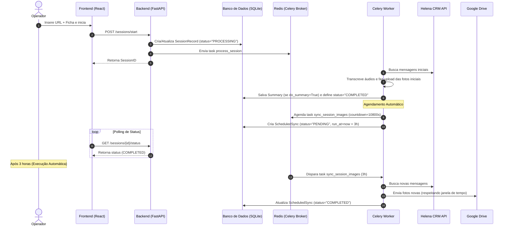
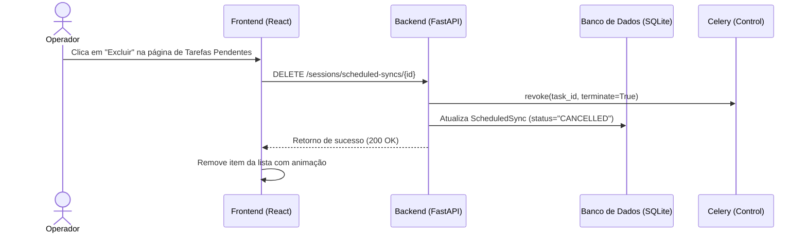

# Especificação Técnica — Novos Recursos do Workflow de Relatórios

Este documento especifica a arquitetura, as alterações de banco de dados, os novos endpoints de API e os componentes de frontend para as seguintes demandas:

1. **Re-checagem Automática de Fotos após 3 Horas**: Agendamento de uma tarefa para re-buscar imagens na Helena API 3 horas após o término do processamento inicial para encontrar novas imagens.
2. **Painel de Tarefas Pendentes**: Nova página no dashboard para listar e gerenciar (excluir/cancelar) tarefas de sincronização agendadas para buscar imagens, quero o id do chat e o nome do contato.
3. **Edição Intermediária de Resumos**: Salvamento de rascunhos editados pelo operador no banco de dados antes da exportação.
4. **Relatório em HTML e Exportação para PDF**: Página de relatório otimizada para impressão que gera PDFs idênticos a relatórios técnicos profissionais diretamente pelo navegador.

---

## 1. Arquitetura e Fluxo de Dados

O diagrama abaixo ilustra o ciclo de vida de uma sessão e o agendamento da tarefa de sincronização de 3 horas.



Se o operador optar por **excluir** a tarefa pendente antes do prazo de 3 horas:



---

## 2. Detalhamento do Banco de Dados (SQLModel)

Adicionaremos a tabela `ScheduledSync` no arquivo [domain.py](file:///e:/Velox/workflow%20relatorio/backend/app/models/domain.py) para persistir as tarefas agendadas e permitir sua exclusão antes da execução.

### Novo Modelo: `ScheduledSync`

```python
from datetime import datetime, timezone
import uuid
from sqlmodel import SQLModel, Field
from typing import Optional

def get_utc_now():
    return datetime.now(timezone.utc)

class ScheduledSync(SQLModel, table=True):
    __tablename__ = "scheduled_sync"
    
    id: str = Field(default_factory=lambda: str(uuid.uuid4()), primary_key=True)
    session_id: str = Field(foreign_key="session.session_id", index=True)
    ficha: str
    task_id: str = Field(unique=True, index=True)  # ID da Task no Celery para possibilitar revogação
    run_at: datetime = Field(index=True)           # Data/hora em que a tarefa executará (UTC)
    status: str = Field(default="PENDING")         # PENDING | COMPLETED | CANCELLED
    created_at: datetime = Field(default_factory=get_utc_now)
```

> [!NOTE]
> A tabela será criada automaticamente ao reiniciar a aplicação, graças ao mecanismo `SQLModel.metadata.create_all(engine)` executado no startup do FastAPI.

---

## 3. Endpoints da API (FastAPI)

Criaremos novos endpoints e modificaremos o endpoint de exportação no arquivo [sessions.py](file:///e:/Velox/workflow%20relatorio/backend/app/api/sessions.py).

### 3.1. Listar Tarefas Pendentes de Sincronização
Retorna todas as tarefas de sincronização que ainda não foram executadas ou canceladas.

* **Método**: `GET`
* **Rota**: `/sessions/scheduled-syncs`
* **Autenticação**: Requer JWT (`CurrentUserDep`)
* **Resposta de Sucesso (200 OK)**:
  ```json
  [
    {
      "id": "e9b23b12-9c1c-4389-a292-6fd52dbd3c2a",
      "sessionId": "46914b43-cfd0-4b53-a8ee-4a87c126df1f",
      "ficha": "85741",
      "runAt": "2026-05-22T17:10:17Z",
      "status": "PENDING",
      "createdAt": "2026-05-22T14:10:17Z"
    }
  ]
  ```

### 3.2. Cancelar/Excluir Tarefa Pendente
Cancela a tarefa no Celery utilizando seu `task_id` e marca o registro correspondente como `CANCELLED`.

* **Método**: `DELETE`
* **Rota**: `/sessions/scheduled-syncs/{id}`
* **Autenticação**: Requer JWT
* **Parâmetros**: `id` da tarefa (UUID)
* **Fluxo**:
  1. Busca o registro de `ScheduledSync` pelo `id`.
  2. Executa `celery_app.control.revoke(scheduled.task_id, terminate=True)`.
  3. Atualiza `scheduled.status = "CANCELLED"`.
  4. Retorna confirmação de sucesso.
* **Resposta de Sucesso (200 OK)**:
  ```json
  {
    "message": "Tarefa de sincronização cancelada com sucesso"
  }
  ```

### 3.3. Salvar Rascunho do Resumo
Salva as edições do resumo realizadas pelo operador diretamente na tabela `Summary` sem a necessidade de enviar os dados para a API externa (Center).

* **Método**: `PUT`
* **Rota**: `/sessions/{session_id}/summary`
* **Autenticação**: Requer JWT
* **Corpo da Requisição**:
  ```json
  {
    "summaryText": "Texto editado pelo operador..."
  }
  ```
* **Resposta de Sucesso (200 OK)**:
  ```json
  {
    "message": "Rascunho do resumo salvo com sucesso"
  }
  ```

### 3.4. Rota para HTML do Relatório (Otimizado para PDF)
Retorna uma página HTML estilizada e minimalista, contendo o resumo e a timeline, configurada com CSS específico de impressão (`@media print`).

* **Método**: `GET`
* **Rota**: `/sessions/{session_id}/report-html`
* **Autenticação**: Requer JWT
* **Resposta**: Página HTML (`HTMLResponse`) contendo o cabeçalho técnico, resumo editado (ou original), timeline e botão de ação para imprimir.

---

## 4. Agendamento Automático no Celery

### 4.1. Modificação na Task `process_session`
Ao final da execução com sucesso de `_async_process_session` em [tasks.py](file:///e:/Velox/workflow%20relatorio/backend/app/services/tasks.py), agendaremos a re-execução para 3 horas depois.

```python
# Trecho a ser adicionado no final da task '_async_process_session'
# após o status ser definido como COMPLETED:

run_at = datetime.now(timezone.utc) + timedelta(hours=3)

# Agendar no Celery para daqui a 3 horas (10800 segundos)
scheduled_task = sync_session_images.apply_async(
    args=[session_id, ficha],
    countdown=10800
)

# Salvar referência no SQLite para controle
with Session(engine) as db_session:
    db_session.add(ScheduledSync(
        session_id=session_id,
        ficha=ficha,
        task_id=scheduled_task.id,
        run_at=run_at,
        status="PENDING"
    ))
    db_session.commit()
    
_log(session_id, f"[Pipeline] Sincronização automática agendada para {run_at.strftime('%d/%m/%Y %H:%M:%S')} UTC")
```

### 4.2. Modificação na Task `sync_session_images`
Para dar baixa na tarefa agendada quando ela rodar, atualizaremos a task para marcar o status como `COMPLETED` no banco de dados.

```python
# Adicionar lógica no final da task sync_session_images em tasks.py:
with Session(engine) as db_session:
    scheduled = db_session.exec(
        select(ScheduledSync)
        .where(ScheduledSync.session_id == session_id)
        .where(ScheduledSync.status == "PENDING")
    ).all()
    
    for s in scheduled:
        s.status = "COMPLETED"
    db_session.commit()
```

---

## 5. Mockup e Detalhamento da Interface (Frontend)

O frontend será aprimorado com uma nova página, rotas e componentes. Para manter o design premium, utilizaremos CSS Vanilla, efeitos de glassmorphism, sombras suaves e fontes modernas.

### 5.1. Nova Rota no React Router ([App.tsx](file:///e:/Velox/workflow%20relatorio/frontend/src/App.tsx))
```tsx
import { PendingTasks } from './pages/PendingTasks';

// Dentro de Routes -> Route element={<Layout />}:
<Route path="/tarefas-pendentes" element={<PendingTasks />} />
```

### 5.2. Item no Menu Lateral ([Layout.tsx](file:///e:/Velox/workflow%20relatorio/frontend/src/components/Layout.tsx))
Adicionaremos o menu de "Tarefas Pendentes" com um badge contendo a contagem em tempo real (obtido via fetch simples ou cache).

```tsx
import { Clock } from 'lucide-react';

// Na lista do menu lateral:
<NavLink 
  to="/tarefas-pendentes" 
  className={({ isActive }) => `nav-item ${isActive ? 'active' : ''}`}
  onClick={() => setIsSidebarOpen(false)}
>
  <Clock size={20} />
  <span>Tarefas Pendentes</span>
</NavLink>
```

### 5.3. Design da Nova Página `PendingTasks.tsx`
A tela apresentará as tarefas pendentes de forma clara, contendo uma contagem regressiva em tempo real para a execução de cada tarefa e um botão estilizado de cancelamento/exclusão.

```typescript
// Componente de contagem regressiva em tempo real para a listagem
const Countdown = ({ targetDate }: { targetDate: string }) => {
  const [timeLeft, setTimeLeft] = useState('');

  useEffect(() => {
    const updateTime = () => {
      const diff = new Date(targetDate).getTime() - new Date().getTime();
      if (diff <= 0) {
        setTimeLeft('Pronto para rodar');
        return;
      }
      const hrs = Math.floor(diff / 3600000);
      const mins = Math.floor((diff % 3600000) / 60000);
      const secs = Math.floor((diff % 60000) / 1000);
      
      setTimeLeft(`${hrs}h ${mins}m ${secs}s`);
    };

    updateTime();
    const interval = setInterval(updateTime, 1000);
    return () => clearInterval(interval);
  }, [targetDate]);

  return <span className="countdown-text">{timeLeft}</span>;
};
```

#### Estilos CSS sugeridos (`PendingTasks.css`)
```css
.pending-tasks-container {
  padding: 2rem;
  max-width: 1200px;
  margin: 0 auto;
}

.tasks-table {
  width: 100%;
  border-collapse: collapse;
  margin-top: 1.5rem;
  border-radius: 12px;
  overflow: hidden;
  box-shadow: 0 8px 32px 0 rgba(0, 0, 0, 0.2);
  background: rgba(255, 255, 255, 0.03);
  backdrop-filter: blur(10px);
  border: 1px solid rgba(255, 255, 255, 0.1);
}

.tasks-table th, .tasks-table td {
  padding: 1rem 1.5rem;
  text-align: left;
  border-bottom: 1px solid rgba(255, 255, 255, 0.05);
}

.tasks-table th {
  background: rgba(255, 255, 255, 0.06);
  font-weight: 600;
  text-transform: uppercase;
  font-size: 0.85rem;
  letter-spacing: 1px;
  color: var(--primary);
}

.badge-pending {
  background: rgba(234, 179, 8, 0.15);
  color: #facc15;
  padding: 0.25rem 0.75rem;
  border-radius: 9999px;
  font-size: 0.8rem;
  font-weight: 600;
  border: 1px solid rgba(234, 179, 8, 0.3);
}

.countdown-text {
  font-family: monospace;
  font-size: 1rem;
  color: #38bdf8;
  font-weight: 600;
}
```

---

## 6. Fluxo de Edição de Resumo e Geração de PDF

Modificaremos o **Quadro de Revisão** no [Dashboard.tsx](file:///e:/Velox/workflow%20relatorio/frontend/src/pages/Dashboard.tsx).

```
                      +-----------------------------+
                      |      Quadro de Revisão      |
                      +-----------------------------+
                      |                             |
                      | [ Área de Texto do Resumo ] |
                      |                             |
                      +-----------------------------+
                       [Salvar Rascunho] [Visualizar/PDF] [MGM (Center)]
```

### 6.1. Salvar Rascunho
Adicionaremos o botão **Salvar Rascunho** ao lado de "Inserir MGM (Center)".
* O botão dispara uma chamada HTTP `PUT` para `/sessions/{session_id}/summary` contendo o texto modificado da área de edição.
* Isso garante que as alterações do operador fiquem gravadas localmente no banco de dados antes da exportação para o PDF, mesmo que o operador decida não enviar o relatório para o Center API ainda.

### 6.2. Nova Ação: Visualizar e Salvar PDF
Criaremos o botão **Visualizar PDF** (ou **Imprimir Relatório**).
* Ao ser clicado, abre em uma nova guia a URL `http://localhost:3000/sessions/{sessionId}/report-html?token={token}`.
* Esta página possui um design impecável contendo a logomarca da Velox, cabeçalho de metadados, o resumo editado renderizado de forma elegante e a timeline.
* No carregamento da página, é chamado `window.print()` por Javascript, exibindo imediatamente o assistente de impressão nativo do navegador configurado para salvar como PDF (Layout A4, Margens Limpas, Cabeçalhos e Rodapés de URL ocultos).

---

## 7. Folha de Estilo de Impressão (CSS Print Layout)

Para gerar um PDF profissional diretamente do navegador sem dependências pesadas de backend (que costumam falhar com caracteres especiais ou quebras de página), utilizaremos estilos CSS avançados para a mídia de impressão.

```css
@media print {
  /* Ocultar elementos desnecessários (botão Imprimir, menus, etc.) */
  .no-print {
    display: none !important;
  }
  
  /* Configuração da Página A4 */
  @page {
    size: A4 portrait;
    margin: 20mm 15mm 20mm 15mm;
  }
  
  body {
    background: #ffffff !important;
    color: #000000 !important;
    font-size: 10pt;
    line-height: 1.5;
  }
  
  /* Evitar quebras de páginas no meio de blocos críticos */
  h1, h2, h3, .report-header {
    page-break-after: avoid;
  }
  
  .timeline-item, blockquote {
    page-break-inside: avoid;
  }
  
  /* Timeline com linha pontilhada clássica em cinza */
  .timeline-container {
    border-left: 2px dotted #cccccc;
    margin-left: 10px;
    padding-left: 15px;
  }
  
  .timeline-time {
    font-weight: bold;
    color: #333333;
  }
}
```

---

## 8. Plano de Validação e Testes

Para garantir a confiabilidade da implementação das funcionalidades especificadas:

### 8.1. Testando a Re-checagem de 3 Horas localmente
Como esperar 3 horas é inviável em ambiente de desenvolvimento, adicionaremos uma variável de ambiente ou parâmetro de controle nas configurações:
* `AUTO_SYNC_DELAY_SECONDS` (Valor padrão: `10800` equivalente a 3 horas).
* Para fins de teste integrado local, esta variável pode ser reduzida no `.env` para `10` segundos.
* **Teste**: Disparar o pipeline e certificar-se de que a tarefa de sincronização roda após 10 segundos, puxando novas mensagens e gravando o status `COMPLETED` na tabela `scheduled_sync`.

### 8.2. Validação da Exclusão
* Agendar uma sincronização automática.
* Consultar a página de **Tarefas Pendentes** no dashboard e verificar se o item está listado e com a contagem regressiva ativa.
* Clicar no botão **Excluir/Cancelar**.
* Confirmar se o registro correspondente no banco de dados foi atualizado para `CANCELLED` e se a task do Celery foi revogada (verificando os logs do contêiner `celery_worker`).

### 8.3. Validação do PDF
* Editar o resumo no dashboard, clicar em **Salvar Rascunho**.
* Atualizar a página do dashboard e verificar se as edições persistem na tela.
* Clicar em **Visualizar PDF**, abrir a nova guia e conferir se as edições estão presentes no cabeçalho do PDF.
* Confirmar se a quebra de página automática do CSS print funciona em timelines muito longas, sem cortar as linhas de mensagens no meio.
